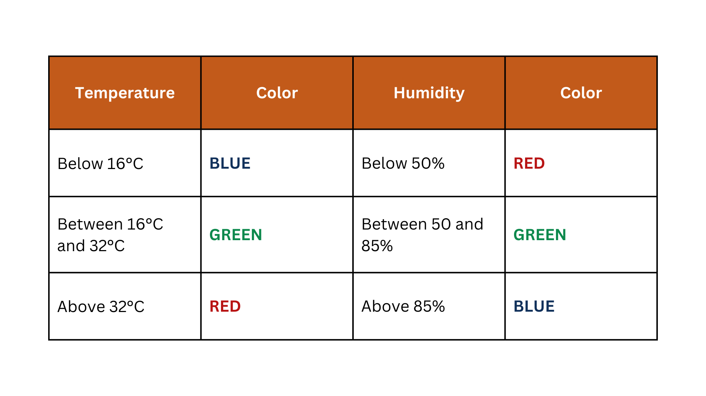

# 🌈 Arduino + ST7789 IPS Display: Full Guide & Weather Project

Welcome to the official GitHub repository for the **“ST7789 Display with Arduino”** tutorial!

This project will teach you how to:
- Connect and control a **135x240 IPS ST7789 display** using SPI
- Customize text, colors, rotation, and background
- Build a real-world **Temperature & Humidity monitor**
- Understand the difference between **SPI vs I2C displays**

This is the companion repo to my YouTube video. If you're here from the video — welcome! And if not, check it out below 👇

🎥 **Watch the full tutorial here**  
🔗 [YouTube Video Link](https://www.youtube.com/@lucasfernandochannel)

---

## 🧠 What is the ST7789 Display?

The ST7789 display is a **full-color IPS screen** that uses **SPI (Serial Peripheral Interface)** for communication. It offers high performance for displaying **graphics, animations, and real-time data** — making it an excellent upgrade from slower I2C displays.

### ✅ Benefits of ST7789 + IPS:
- Full **RGB colors**
- **Wide viewing angles**
- **Fast refresh rates**
- **Perfect for games, dashboards, and visual feedback**

> ⚠️ Note: This display is delicate. As you’ll see in the video, I damaged mine slightly during setup — be gentle with yours!

---

## 📦 What’s Included in This Repo?

| File/Folder                | Description                                          |
|---------------------------|------------------------------------------------------|
| `hello-world.ino`         | Basic display test with text output                 |
| `temp-and-humidity.ino`   | Full weather station project with DHT11             |
| `images/`                 | Diagrams, wiring schematics, output screenshots     |

---

## 🛠️ Hardware & Parts List

| Component                | Quantity | Notes                            |
|-------------------------|----------|----------------------------------|
| Arduino Nano            | 1        | (Or any Arduino board)           |
| ST7789 1.14" IPS Display| 1        | 135x240 resolution, 8 pins       |
| DHT11 Sensor            | 1        | For temperature & humidity       |
| Breadboard + Wires      | 1 set    | Jumper wires for connections     |
| Type-C USB Cable        | 1        | To upload code                   |

---

## 🧰 Libraries Required

Before uploading code, install these libraries from the **Arduino Library Manager**:

- `Adafruit_GFX`
- `Adafruit_ST7789`
- `Adafruit_Sensor`
- `DHT`

---

## 🧩 Project 1: Hello World Display

This is your first interaction with the screen. It shows a welcome message and teaches you how to:

- Initialize the display
- Set screen rotation
- Change background and text colors
- Adjust text size and position

### 📸 Output Example


---

### 🔌 Wiring Diagram (ST7789 Only)

> Arduino Nano → ST7789 Display

| Display Pin | Arduino Pin | Description            |
|-------------|-------------|------------------------|
| GND         | GND         | Ground                 |
| VCC         | 5V          | Power                  |
| SCL         | D13         | SPI Clock              |
| SDA         | D11         | SPI Data (MOSI)        |
| RES         | D8          | Reset                  |
| DC          | D7          | Data/Command           |
| CS          | D10         | Chip Select            |
| BLK         | 5V          | Backlight (optional)   |

📷 *[Click here to view full-resolution diagram](arduino-nano-with-st7789.png)*  
📝 *Double-check the pinout before powering on!*

---

## 🧩 Project 2: Temperature & Humidity Monitor

Now let’s add a **DHT11 sensor** and turn this screen into a real-time weather dashboard!

### 🧠 Features
- Reads **temperature** and **humidity**
- Alternates between **Celsius and Fahrenheit**
- Colors change dynamically based on sensor values
- Fully customizable UI on the screen

### 📸 Output Example


---

### 🔌 Updated Wiring Diagram (ST7789 + DHT11)

| Display Pin | Arduino Pin | Description            |
|-------------|-------------|------------------------|
| GND         | GND         | Ground                 |
| VCC         | 5V          | Power                  |
| SCL         | D13         | SPI Clock              |
| SDA         | D11         | SPI Data (MOSI)        |
| RES         | D8          | Reset                  |
| DC          | D7          | Data/Command           |
| CS          | D10         | Chip Select            |
| BLK         | 5V          | Backlight              |
| DHT11 OUT   | D2          | Sensor Data            |
| DHT11 VCC   | 5V          | Sensor Power           |
| DHT11 GND   | GND         | Sensor Ground          |

📷 *[Click here to view wiring diagram](images/st7789-and-dht11.png)*

---

### 🎨 Color Logic Table

To make it more visual, the display uses color-coding based on sensor values.



---

## 📂 Folder Breakdown

```bash
📁 ST7789-Display-Tutorial/

├── code/
│   ├── colorful-animation/
│   │   ├── colorful-animation.ino       # Colorful animation to test the screen
│   ├── hello-word/
│   │   ├── hello-world.ino              # Hello world display test
│   ├── temp-and-humidity/
│   │   ├── temp-and-humidity.ino        # Weather dashboard using DHT11
├── images/
│   ├── arduino-nano-with-st7789.png
│   ├── environment-monitoring-table.png
│   ├── project-1-1.jpg
│   ├── project-1-2.jpg
│   ├── project-1-3.jpg
│   ├── project-1-4.jpg
│   ├── project-1-5.jpg
│   ├── project-2-1.jpg
│   ├── project-2-2.jpg
│   ├── project-2-3.jpg
│   ├── project-2-4.jpg
│   ├── project-2-5.jpg
│   ├── st7789-and-dht11.png
│   ├── st7789-with-arduino-pinout.png
